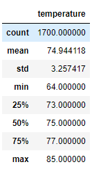
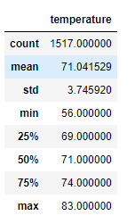
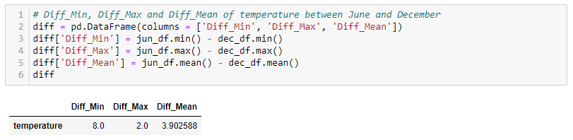
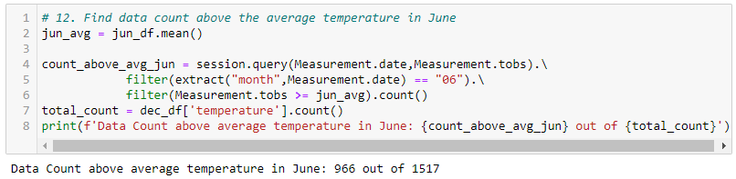
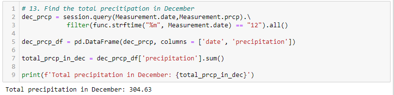

# Surfs_up

## **Overview of Surfs up Project**

### Provide the Summary Statistics for June and December to assist W. Avy in determining if her surf and ice cream shop business is sustainable year-round.

## **Results**

- **Filtered the date column of the Measurements table in the database to retrieve all the temperatures for June. Stored in DataFrame and generated the summary statistics.**

  <table>
  <tr>
    <td>Summary Statistics of June</td>
  </tr>
  <tr>
    <td></td>
  </tr>
  </table>
  
- **Filtered the date column of the Measurements table in the database to retrieve all the temperatures for December. Stored in DataFrame and generated the summary statistics.**
  
  <table>
  <tr>
    <td>Summary Statistics of December</td>
  </tr>
  <tr>
    <td></td>
  </tr>
  </table>
  
- **Calculated the Diff_Min, Diff_Max, and Diff_Mean between June and December.**
  
  <table>
  <tr>
    <td>The Difference of Temperature</td>
  </tr>
  <tr>
    <td></td>
  </tr>
  </table>
  
## **Summary**

- **Upon comparing the Min, Max, and Average temperatures of June and December, we see no significant changes in temperature. This means that W. Avy's surf and ice cream is potentially sustainable year-round.**
  
- **To further understand the temperature in June, we conducted a data count to show how often the temperature is above the average during the month of June. We can see that 966 out 0f 1517 records exceeded the average temperature.**
  
  <table>
  <tr>
    <td>Data Count Over Average Temperature</td>
  </tr>
  <tr>
    <td></td>
  </tr>
  </table>

- **To provide an insight into how the precipitation affected the business in December, we studied the total precipitation throughout the month.**
  
  <table>
  <tr>
    <td>Total Precipitation in December</td>
  </tr>
  <tr>
    <td></td>
  </tr>
  </table>